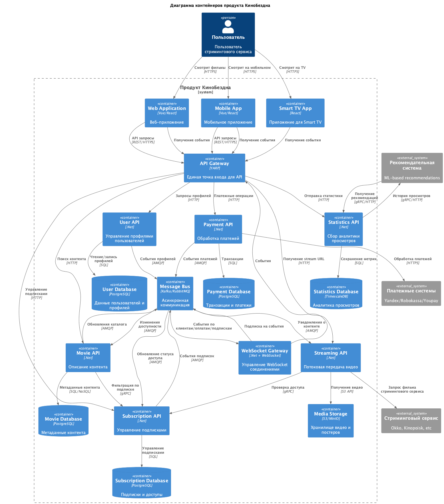
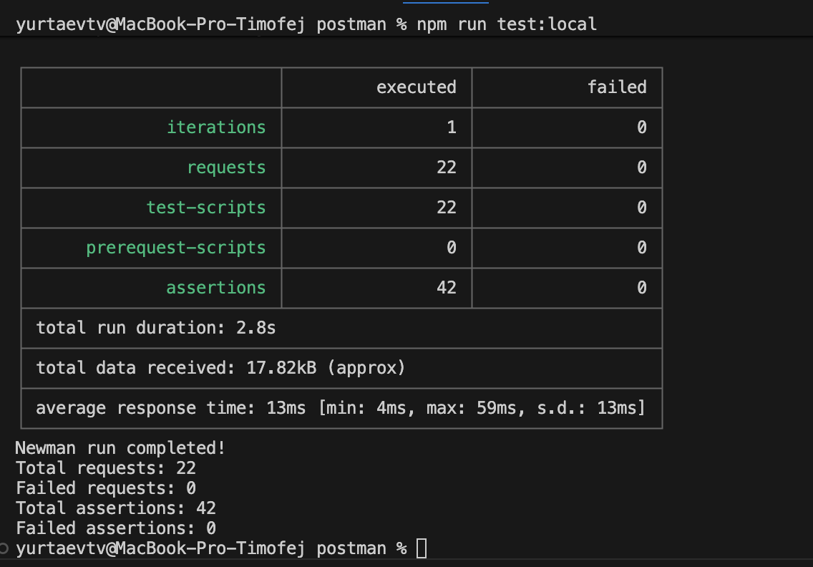
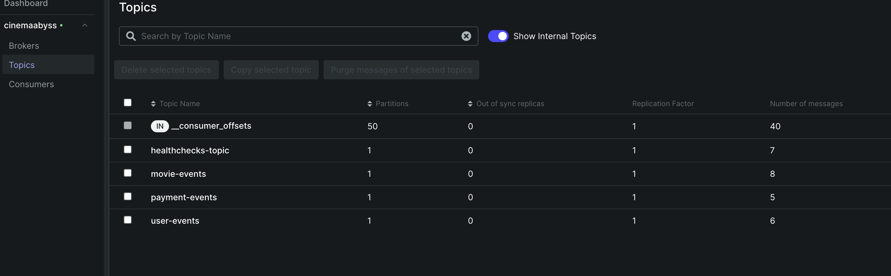
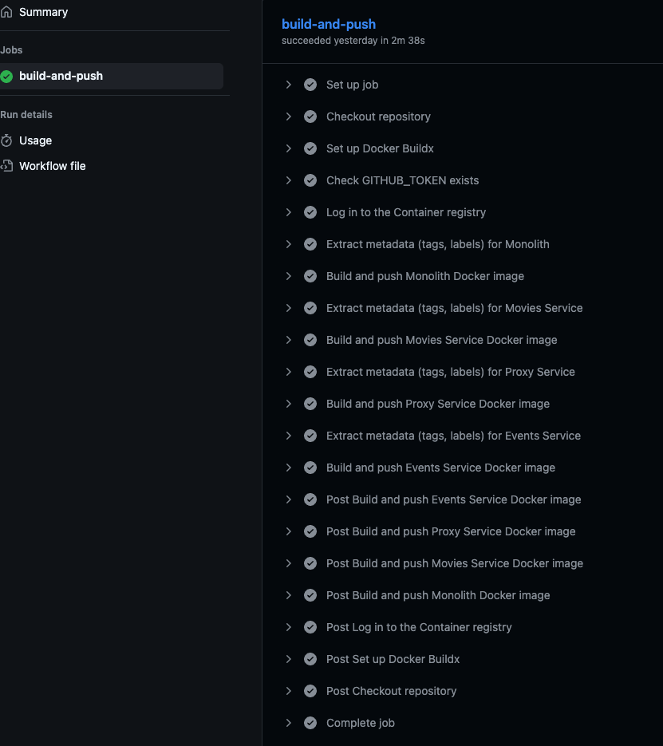
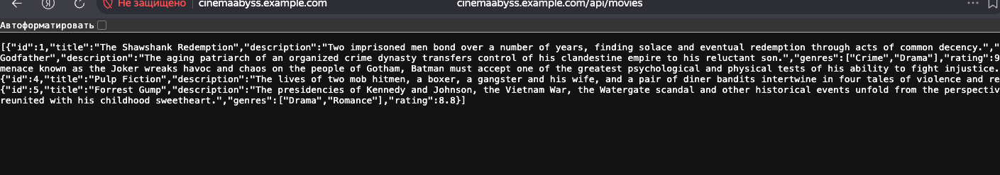
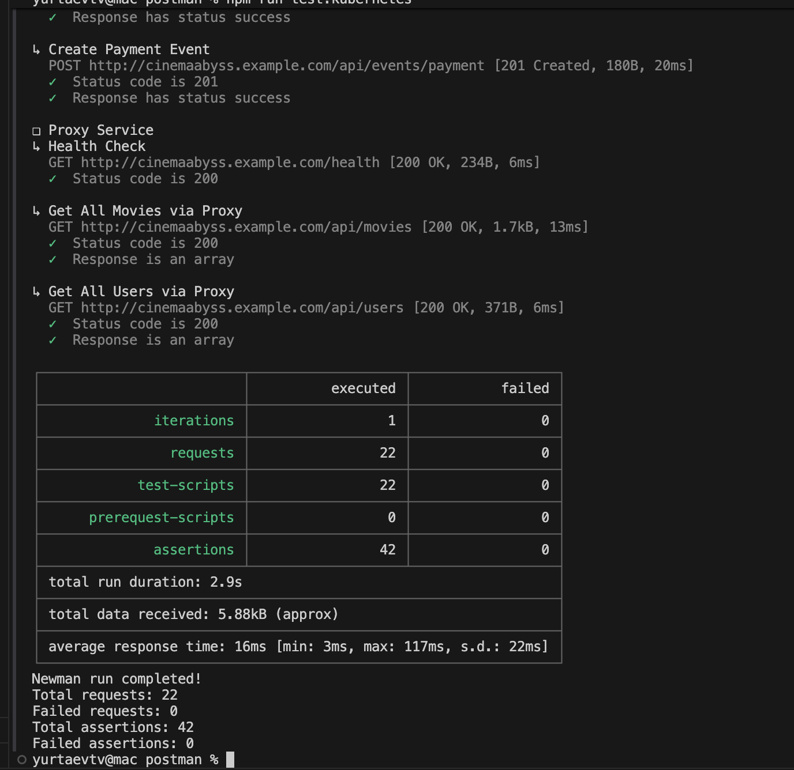
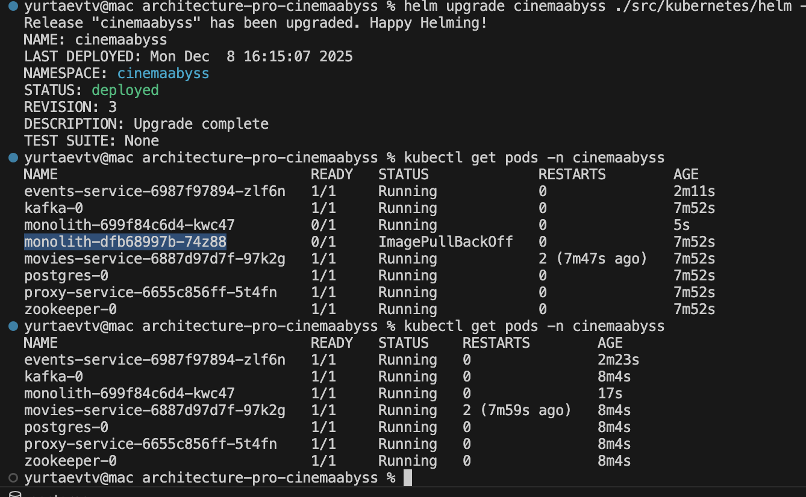
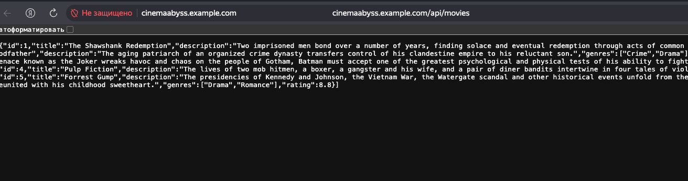
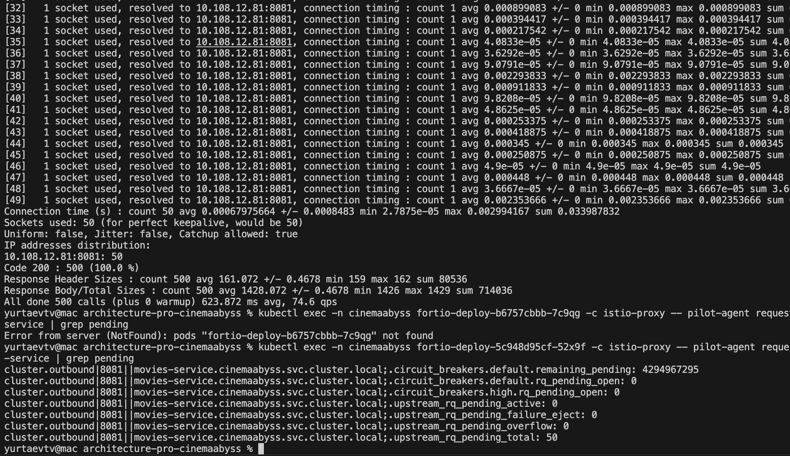

## Изучите [README.md](README.md) файл и структуру проекта.

## Задание 1

1. 
Архитектура КиноБездны, разделенная на отдельные домены с единой точкой вызова сервисов. Должна содержать в себе следующие домены: 
- Пользователи
- Фильмы
- Оплаты
- Подписки

Интеграционное взаимодействие должно быть налажено следующим образом:

Спроектируйте to be архитектуру КиноБездны, разделив всю систему на отдельные домены и организовав интеграционное взаимодействие и единую точку вызова сервисов.
Результат представьте в виде контейнерной диаграммы в нотации С4.
Добавьте ссылку на файл в этот шаблон

[диаграмма контейнеров](./schemas/container/cinemaAbyssC4Container.puml)

## Задание 2

### 1. Proxy

Переход успещно выполняется. Все переменные окружения помещены в .env файл для централизованного управления

### 2. Kafka

Внедрение Kafka не вызвало проблем. 
 

## Задание 3

### CI/CD

Налажено:
- образы image и proxy собираются и сторятся без ошибок
- Api-test.yml так же выполняется без ошибок

### Proxy в Kubernetes

#### Шаг 1
#### Шаг 2

Во время пусконалодочных работ были проблемы: клиент Kafka для .net не хотел работать в arm64. Пришлось выполнить его сборку в DockerFile. После этого работа сервисов в Kebernetes прошла без проблем. Тесты выполнены без ошибок. 

  

Список фильмов из k8s

Результат тестов

## Задание 4

Для простоты дальнейшего обновления и развертывания вам как архитектуру необходимо так же реализовать helm-чарты для прокси-сервиса и проверить работу 

Исправление конфигурации выполнен успешно: 

cinemaabyss.example.com работает успешно

# Задание 5

Сетевой паттерн Circuit Breaker выполнен успешно:

